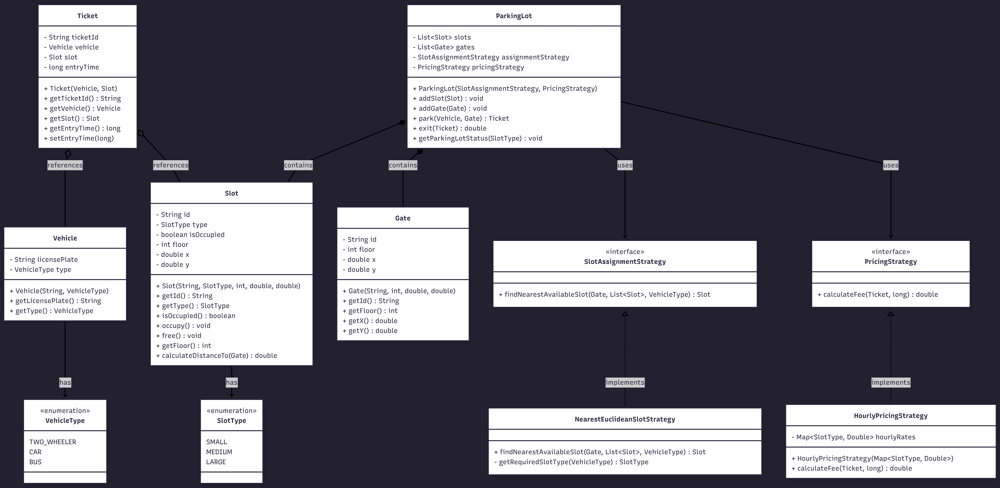

# Multi-Level Parking Lot

An object-oriented implementation of a multi-level parking lot system in Java. The design maps physical entities into a software architecture utilizing SOLID principles.

## System Architecture

* **Strategy Pattern:** Uses a `SlotAssignmentStrategy` to find the nearest slot (via 3D Euclidean distance) and a `PricingStrategy` to calculate hourly fees based on vehicle type. This keeps the core logic highly extensible.
* **Entities:** Core physical components are cleanly mapped to decoupled domain classes like `Slot`, `Gate`, `Vehicle`, and `Ticket`.
* **Design Trade-offs:** The current implementation uses an $O(N)$ linear search to assign the nearest parking slot. While perfectly functional and simple for initial design. For high-traffic, massive-scale systems, this would be optimized using a Min-Heap or `PriorityQueue` cache to achieve $O(1)$ retrieval. Thread safety is also omitted to keep the core logic simple.

## Class Diagram



## How to Run

Compile and execute all classes using standard Java commands in the root directory:

```bash
javac *.java
java Main