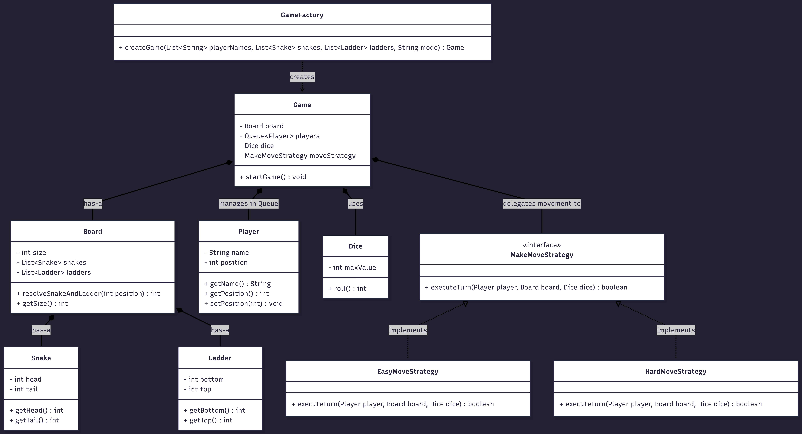

# Snake and Ladder 

A clean, object-oriented implementation of the classic Snake and Ladder game in Java, designed with a strong focus on modularity and SOLID principles.

## System Design & Architecture

This application models the physical game board into distinct software entities, ensuring high extensibility for future rule changes. 

* **Strategy Pattern:** Player movement and win conditions are abstracted into a `MakeMoveStrategy`. This allows seamless toggling between "Easy" and "Hard" game modes without modifying the core `Game` loop (Open/Closed Principle).
* **Factory Pattern:** The `GameFactory` encapsulates the complex instantiation of the board, domain entities, and player queues, keeping the main execution clean.
* **Single Responsibility:** Domain entities (`Snake`, `Ladder`, `Player`, `Dice`) maintain only their specific states. The `Board` solely resolves positions, while the `Game` class orchestrates the turn-based queue.

## Class Diagram



## Core Entities

* `Game`: Manages the round-robin player queue and coordinates turns.
* `Board`: Stores the grid boundaries and evaluates interactions with board entities.
* `Snake` / `Ladder`: Immutable domain objects defining start and end coordinates.
* `Player`: Tracks individual player names and current board positions.
* `Dice`: Generates randomized roll values.

## How to Run

Compile and execute the main class using standard Java commands:

```bash
javac Main.java
java Main